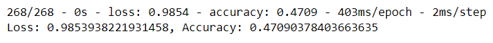

# Neural_Network_Charity_Analysis

## Overview

Using the features in the provided dataset, create a binary classifier that is capable of predicting whether applicants will be successful if funded by Alphabet Soup.

From Alphabet Soup’s business team, there are more than 34,000 organizations that have received funding from Alphabet Soup over the years. Within this dataset are a number of columns that capture metadata about each organization, such as the following:

- EIN and NAME—Identification columns
- APPLICATION_TYPE—Alphabet Soup application type
- AFFILIATION—Affiliated sector of industry
- CLASSIFICATION—Government organization classification
- USE_CASE—Use case for funding
- ORGANIZATION—Organization type
- STATUS—Active status
- INCOME_AMT—Income classification
- SPECIAL_CONSIDERATIONS—Special consideration for application
- ASK_AMT—Funding amount requested
- IS_SUCCESSFUL—Was the money used effectively

### Resources

#### Data

- charity_data.csv

#### Software Tools

- [Jupyter Notebook v6.4.6](https://jupyter-notebook.readthedocs.io/en/stable/index.html)
- [SciKit-Learn Library v 1.0.2](https://scikit-learn.org/stable/getting_started.html)
  - [OneHotEncoder](https://scikit-learn.org/stable/modules/generated/sklearn.preprocessing.OneHotEncoder.html?highlight=onehotencoder#sklearn.preprocessing.OneHotEncoder)
  - [StandardScaler](https://scikit-learn.org/stable/modules/generated/sklearn.preprocessing.StandardScaler.html)
- [Tensor Flow](https://www.tensorflow.org/guide/)
  - [Sequential Model](https://www.tensorflow.org/guide/keras/sequential_model)
  - [Broweser 'playground' Model](https://playground.tensorflow.org/#activation=tanh&batchSize=10&dataset=spiral&regDataset=reg-plane&learningRate=0.03&regularizationRate=0&noise=0&networkShape=8&seed=0.14370&showTestData=false&discretize=false&percTrainData=50&x=true&y=true&xTimesY=true&xSquared=true&ySquared=true&cosX=false&sinX=false&cosY=false&sinY=false&collectStats=false&problem=classification&initZero=false&hideText=false)

## Results

### ***Data Preprocessing***

Once the `charity_data.csv` file was read into a dataframe, the data was split into features and target variables to train and test the `SequentialModel`:

  - The **IS_SUCCESSFUL** column was used as a target variable, since it measures successful use of money, and therefore an ideal candidate for the model.
  - The **EIN** and **NAME** columns are unique categorical identifiers dropped for this model.
  - The remaining columns were used as features for the model and preprocessed 

1. Check for features value counts that can be binned using a density plot:
  - APPLICATION_TYPE
  - CLASSIFICATION


2. Create replacement 'other' bin to place value counts into:

```Python
# Determine which values to replace if counts are less than ...?
replace_application = list(app_type_counts[app_type_counts < 200].index)

# Replace in dataframe
for app in replace_application:
    application_df.APPLICATION_TYPE = application_df.APPLICATION_TYPE.replace(app,"Other")
    
# Check to make sure binning was successful
application_df.APPLICATION_TYPE.value_counts()
```

```Python
# Determine which values to replace if counts are less than ..?
replace_class = list(classification_counts[classification_counts < 1000].index)

# Replace in dataframe
for cls in replace_class:
    application_df.CLASSIFICATION = application_df.CLASSIFICATION.replace(cls,"Other")
    
# Check to make sure binning was successful
application_df.CLASSIFICATION.value_counts()
```
3. Create a list of object categories so `OneHotEncoder()` can transform them into encoded values:

```Python
# Generate our categorical variable lists
app_cat = application_df.dtypes[application_df.dtypes == "object"].index.tolist() \
```
```Python
# Create a OneHotEncoder instance
enc = OneHotEncoder(sparse=False)

# Fit and transform the OneHotEncoder using the categorical variable list
encode_df = pd.DataFrame(enc.fit_transform(application_df[app_cat]))
# Add the encoded variable names to the dataframe
encode_df.columns = enc.get_feature_names_out(app_cat)
```

4. Merge the `encode_df` with the `application_df` and drop any of the original columns.

```Python
# Merge one-hot encoded features and drop the originals
application_df = application_df.merge(encode_df, left_index=True, right_index=True)
application_df = application_df.drop(app_cat, 1)
application_df.head()
```


5. Split, train, standardize, and scale data.

```Python
# Split our preprocessed data into our features and target arrays
X = application_df.drop(columns=['IS_SUCCESSFUL']).values
y = application_df['IS_SUCCESSFUL'].values

# Split the preprocessed data into a training and testing dataset
X_train, X_test, y_train, y_test = train_test_split(X, y, random_state=1)
```
```Python
# Create a StandardScaler instances
scaler = StandardScaler()

# Fit the StandardScaler
X_scaler = scaler.fit(X_train)

# Scale the data
X_train_scaled = X_scaler.transform(X_train)
X_test_scaled = X_scaler.transform(X_test)
```

### ***Compiling, Training, and Evaluating the Model***

1. There are 43 input nodes, so 80 nodes were used for the first hidden layer (~2x). An additional hidden layer was added with less than half of the input nodes as the first, to help decrease complexity. `relu` and `sigmoid` activation functions were used in this model.  

```Python
# Define the model - deep neural net, i.e., the number of input features and hidden nodes for each layer.
number_input_features = len(X_train[0])
hidden_nodes_layer1 = 80
hidden_nodes_layer2 = 30
nn = tf.keras.models.Sequential()

# First hidden layer
nn.add(tf.keras.layers.Dense(units=hidden_nodes_layer1, input_dim = number_input_features, activation="relu"))

# Second hidden layer
nn.add(tf.keras.layers.Dense(units=hidden_nodes_layer2, activation="relu"))

# Output layer
nn.add(tf.keras.layers.Dense(units=1, activation="sigmoid"))


# Check the structure of the model
nn.summary()
```


2. The model was run for 100 `epochs`, with checkpoints saved every 5 `epochs`.

```Python
# Import Checkpoint Dependencies  
import os
from tensorflow.keras.callbacks import ModelCheckpoint

# Define the checkpoint path and filename
os.makedirs("checkpoints/", exist_ok=True)
checkpoint_path = "checkpoints/weights.{epoch:02d}.hdf5"
```
```Python
# Create a callback that saves the model's weights every 5 epoch
cp_callback = ModelCheckpoint(
    filepath=checkpoint_path,
    verbose=1,
    save_weights_only=True,
    period = 5)
```
```Python
# Train the model
fit_model = nn.fit(X_train, y_train, epochs=100, callbacks=[cp_callback])
```

3. The final model performed at about 69% accuracy with approximately 0.689 loss.

  

4. Steps 1-3 were repeated to optimize the model
  - The INC_AMT column was binned just like CLASSIFICATION and APP_TYPE columns were
  - About 2.5 times the amout of input nodes were selected for the first hidden layer, with each additional including less. 3 hidden layers were included all together
  - `sigmoid`,`relu`, and `tanh` activations were used in a variety of combinations
  - A variety of training cycles were attempted. Smallest cycle was 100 `epochs`, while the largest ran up to 500 `epochs` 
 
```Python
# Define the model - deep neural net, i.e., the number of input features and hidden nodes for each layer.
number_input_features = len(X_train[0])
hidden_nodes_layer1 = 100
hidden_nodes_layer2 = 90
hidden_nodes_layer3 = 50
nn = tf.keras.models.Sequential()

# First hidden layer (with different activation equation)
nn.add(tf.keras.layers.Dense(units=hidden_nodes_layer1, input_dim = number_input_features, activation="relu"))

# Second hidden layer (with different activation equation)
nn.add(tf.keras.layers.Dense(units=hidden_nodes_layer2, activation="sigmoid"))

# Third hidden layer (with different activation equation)
nn.add(tf.keras.layers.Dense(units=hidden_nodes_layer3, activation="tanh"))

# Output layer
nn.add(tf.keras.layers.Dense(units=1, activation="relu"))


# Check the structure of the model
nn.summary()
```   


5. The optimized model struggled to reach better performance with the described adjustments.



## Summary

This model was able to predict succesful applicants for the charity with approximately 69% accuracy. After further optimization, this model performed worse. The amount of parameters increased from 5,981 in the first iteration, to 17,691. Furthermore, the hidden layers and the nodes included added an increased layer of complexity that this dataset could not be modeled well after. Instead of adding layers, this model could benefit from reduction of layers and training cycles to better predict applicant's success.
